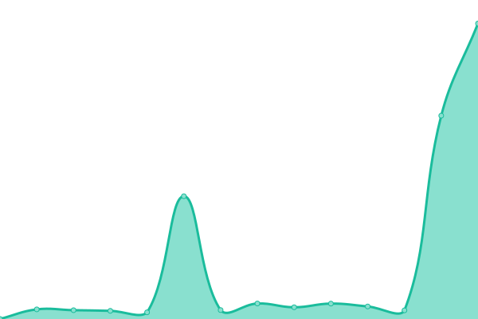
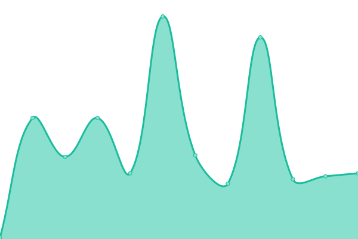
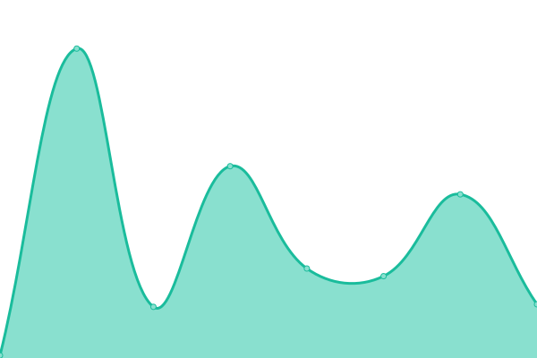

# [📈 Live Status](https://RyuXyro.github.io/status): <!--live status--> **🟧 Partial outage**

This repository contains the open-source uptime monitor and status page for [Risky](https://RyuXyro.github.io/status), powered by [Upptime](https://github.com/upptime/upptime).

With [Upptime](https://upptime.js.org), you can get your own unlimited and free uptime monitor and status page, powered entirely by a GitHub repository. We use [Issues](https://github.com/RyuXyro/status/issues) as incident reports, [Actions](https://github.com/RyuXyro/status/actions) as uptime monitors, and [Pages](https://RyuXyro.github.io/status) for the status page.

<!--start: status pages-->
<!-- This summary is generated by Upptime (https://github.com/upptime/upptime) -->
<!-- Do not edit this manually, your changes will be overwritten -->
<!-- prettier-ignore -->
| URL | Status | History | Response Time | Uptime |
| --- | ------ | ------- | ------------- | ------ |
|  [KazuoYuuka site](https://kazuoyuuka.rf.gd) | 🟥 Down | [kazuo-yuuka-site.yml](https://github.com/RyuXyro/status/commits/HEAD/history/kazuo-yuuka-site.yml) | 

 0ms
     
 | 

<a href="https://RyuXyro.github.io/status/history/kazuo-yuuka-site">0.00%</a>
    

|  [RyuXyro site](http://ryuxyro.epizy.com) | 🟩 Up | [ryu-xyro-site.yml](https://github.com/RyuXyro/status/commits/HEAD/history/ryu-xyro-site.yml) | 

 1588ms
     
 | 

<a href="https://RyuXyro.github.io/status/history/ryu-xyro-site">93.86%</a>
    

|  [RyuXyro blog](http://blog.ryuxyro.epizy.com) | 🟩 Up | [ryu-xyro-blog.yml](https://github.com/RyuXyro/status/commits/HEAD/history/ryu-xyro-blog.yml) | 

 3103ms
     
 | 

<a href="https://RyuXyro.github.io/status/history/ryu-xyro-blog">68.21%</a>
    

|  [Erlangga blog](https://erlanggaagung.epizy.com) | 🟥 Down | [erlangga-blog.yml](https://github.com/RyuXyro/status/commits/HEAD/history/erlangga-blog.yml) | 

 0ms
     
 | 

<a href="https://RyuXyro.github.io/status/history/erlangga-blog">100.00%</a>
    

|  [Moe Count](https://moe-count.glitch.me) | 🟩 Up | [moe-count.yml](https://github.com/RyuXyro/status/commits/HEAD/history/moe-count.yml) | 

 2384ms
     
 | 

<a href="https://RyuXyro.github.io/status/history/moe-count">100.00%</a>
    

|  [Insta Downloader](https://ryuxyro.github.io/igdownloader/) | 🟩 Up | [insta-downloader.yml](https://github.com/RyuXyro/status/commits/HEAD/history/insta-downloader.yml) | 

 71ms
     
 | 

<a href="https://RyuXyro.github.io/status/history/insta-downloader">100.00%</a>
    

|  [Status](https://ryuxyro.github.io/status/) | 🟩 Up | [status.yml](https://github.com/RyuXyro/status/commits/HEAD/history/status.yml) | 

 37ms
     
 | 

<a href="https://RyuXyro.github.io/status/history/status">0.00%</a>
    

|  [School Website](https://www.smpkstvincentius.sch.id/) | 🟩 Up | [school-website.yml](https://github.com/RyuXyro/status/commits/HEAD/history/school-website.yml) | 

 1768ms
     
 | 

<a href="https://RyuXyro.github.io/status/history/school-website">100.00%</a>
    

<!--end: status pages-->

## 📄 License

- Powered by: [Upptime](https://github.com/upptime/upptime)
- Code: [MIT](./LICENSE) © [Anand Chowdhary](https://anandchowdhary.com), supported by [Pabio](https://pabio.com)
- Data in the `./history` directory: [Open Database License](https://opendatacommons.org/licenses/odbl/1-0/)
