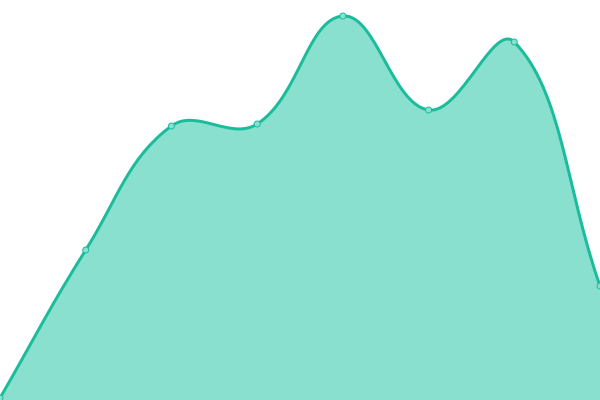

# [📈 Live Status](https://RyuXyro.github.io/status): <!--live status--> **🟧 Partial outage**

This repository contains the open-source uptime monitor and status page for [Risky](https://RyuXyro.github.io/status), powered by [Upptime](https://github.com/upptime/upptime).

With [Upptime](https://upptime.js.org), you can get your own unlimited and free uptime monitor and status page, powered entirely by a GitHub repository. We use [Issues](https://github.com/RyuXyro/status/issues) as incident reports, [Actions](https://github.com/RyuXyro/status/actions) as uptime monitors, and [Pages](https://RyuXyro.github.io/status) for the status page.

<!--start: status pages-->
<!-- This summary is generated by Upptime (https://github.com/upptime/upptime) -->
<!-- Do not edit this manually, your changes will be overwritten -->
<!-- prettier-ignore -->
| URL | Status | History | Response Time | Uptime |
| --- | ------ | ------- | ------------- | ------ |
|  [Risky](https://ryuxyro.my.id/) | 🟥 Down | [risky.yml](https://github.com/RyuXyro/status/commits/HEAD/history/risky.yml) | 

 0ms
     
 | 

<a href="https://RyuXyro.github.io/status/history/risky">0.00%</a>
    

|  [Instagram Downloader](https://ryuxyro.github.io/igdownloader/) | 🟩 Up | [instagram-downloader.yml](https://github.com/RyuXyro/status/commits/HEAD/history/instagram-downloader.yml) | 

 136ms
     
 | 

<a href="https://RyuXyro.github.io/status/history/instagram-downloader">100.00%</a>
    

|  [safefileku](https://download.safefileku.com/file/aRgzuragzItxb9h4/image1.jpeg/download?hash=cygK8SbTH3vZxDIcJR_Vzw&expire=1749506860&v=2) | 🟥 Down | [safefileku.yml](https://github.com/RyuXyro/status/commits/HEAD/history/safefileku.yml) | 

 155ms
     
 | 

<a href="https://RyuXyro.github.io/status/history/safefileku">0.00%</a>
    

|  [Status](https://ryuxyro.github.io/status/) | 🟩 Up | [status.yml](https://github.com/RyuXyro/status/commits/HEAD/history/status.yml) | 

 29ms
     
 | 

<a href="https://RyuXyro.github.io/status/history/status">0.00%</a>
    

<!--end: status pages-->

## 📄 License

- Powered by: [Upptime](https://github.com/upptime/upptime)
- Code: [MIT](./LICENSE) © [RyuXyro](https://github.com/RyuXyro)
- Data in the `./history` directory: [Open Database License](https://opendatacommons.org/licenses/odbl/1-0/)
